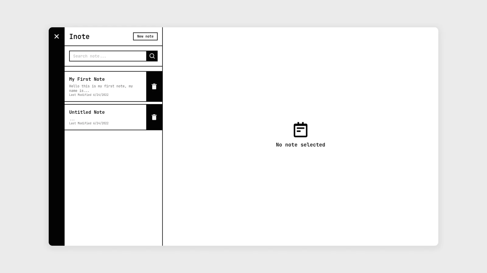

## About Project



Simple classic note app that can save notes in Local Storage. With a responsive application display. In addition, this application can work offline (PWA).

[Demo App](https://herdianurdin.github.io/inote/)

### JSON Structure
```JSON
[
  {
    "id": "1ded1ac-ee8b-58b1-26e-7360da2200c1",
    "title": "Example title",
    "body": "Example body",
    "updatedAt": 1652009772511
  }
]
```
### Built With
[](https://reactjs.org/)


## Getting Started

### Prerequisites
```sh
npm install npm@latest -g
```

### Installation

1. Clone the repo
```sh
git clone https://github.com/herdianurdin/inote.git
```
2. Install NPM packages
```sh
npm install
```

## Usage

### Run Project
```sh
npm run start
```
### Build Project
```sh
npm run build
```

## License

Distributed under the  GPL-3.0 License. See [LICENSE](LICENSE) for more information.